#Readme
------
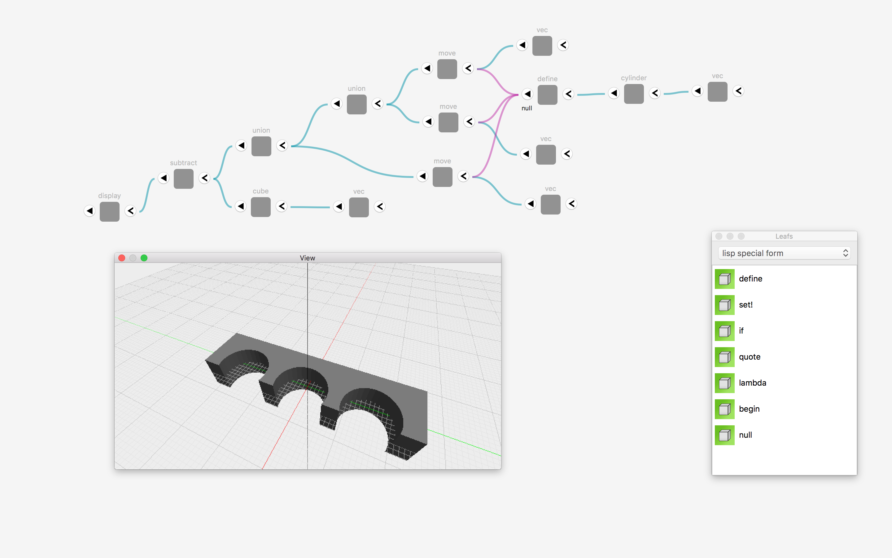
#About
mintはリーフと呼ばれるブロックをつなげて形状を記述するCADです。
立方体や円柱といった基本的な形状を表すリーフと、回転や移動、あるいは合成や除算といったブーリアン処理を行うリーフを組み合わせて形を作っていきます。

一般的なCADほど直感的ではないものの、パラメトリックな操作やアルゴリズムによる形状生成が可能です。
##mintとmint-lisp
内部的にはmintはlispのインタプリタ(mint-lisp)として実装されています。.mint形式のファイルをテキストエディタで開いてみるとlispのコードを見ることができます。このレポジトリのコードはリーフの操作やUI周りが中心です。
##License
mintはGPL v3、mint-lispはapache-2.0となります。
##注意/Caution!
mintはまだ開発中の要素が多く、実装されていない機能（そして多分バグ）が沢山あります。使用される場合は、ご承知の上での使用をお願いいたします。
#Getting Started
##hello world!
簡単な立方体を描画してみる。

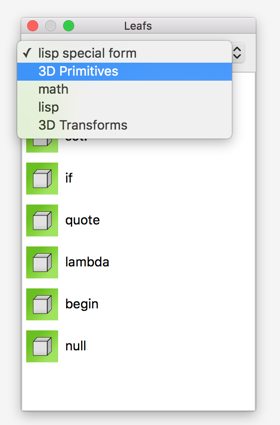
リーフはパレットから選択する。（あまり整理されていないので改善項目...）

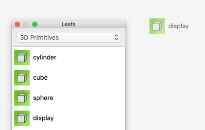

リーフパレットからドラッグアンドドロップでリーフを作成する。

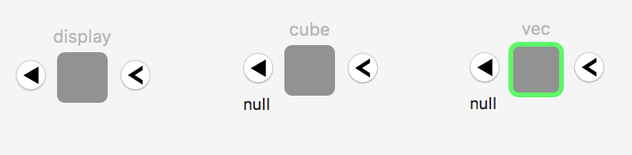

今回使うのはこの３つ。display, cube, vec。displayはポリゴンを描画してくれる。vecは３次元ベクトルで、今回は立方体の中心位置を指定するのに使う。cubeはパラメータから立方体のポリゴンを生成する。

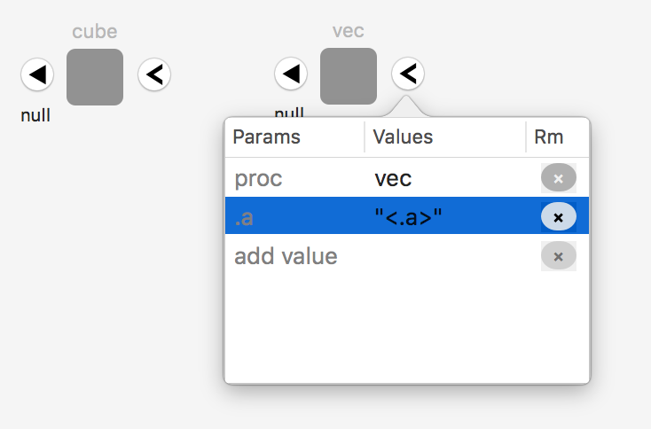

vecの右側の[>]をクリックするとパラメータ（引数）を入力するポップアップが出てくるので、Valuesの列に0を入力する。add value行に入力するとパラメータ行を追加できる。vecは引数を2つ渡すとzを0として解釈するので、0を二つ入力すれば原点を示す。

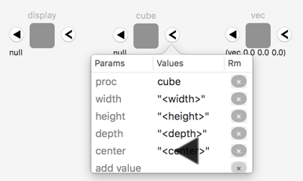

作成したvecの戻り値をcubeのパラメータとして渡してやる。vecの左側の[◀︎]ボタンをドラッグアンドドロップでcubeのcenter行に渡してやるとリンクされる。逆に"center"を[◀︎]にドラッグアンドドロップしても良い。
注意点はリーフは複数のパラメータを持てるが、戻り値は一つのリーフにしかリンクできないこと（木構造）。複数のリーフで戻り値を利用したい場合は一度変数にバインドしてやる必要がある。

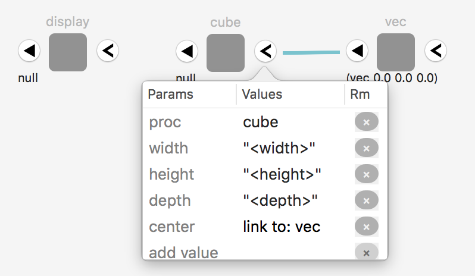

リンク状態になると青い線がリーフの間に表示され、パラメータでlink to:と表示される。解除する場合は右の×印をクリック。

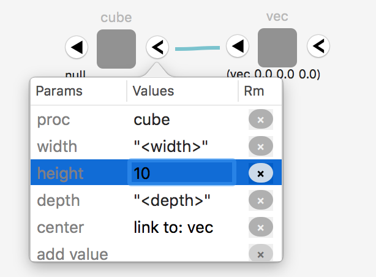

cubeの他のパラメータを入力する。幅、高さ、奥行き。（ちなみにリーフの名称（この場合はcube）自体も編集でき、cubeリーフをvecなど他のリーフに変更することもできる）

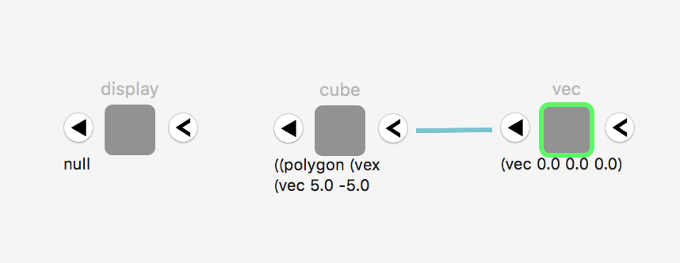

計算はリーフを編集するたびにバックグランドで自動で行われるので、リーフの下側に計算結果が表示される。

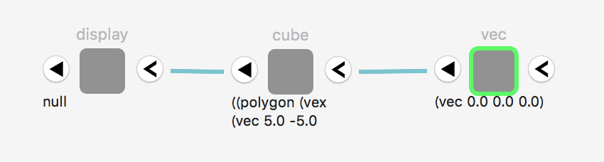

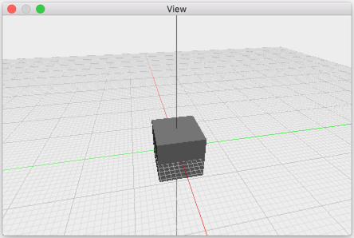

最後にdisplayへcubeの戻り値をリンクしてやると、view画面に立方体が表示される。

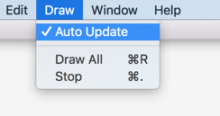

なお、リーフを編集するたびに自動計算するのを止めたい場合はDrawメニューのAuto UpdateをOffにする。また、無限再帰などになった場合はStopで止めることができる(バックグラウンドで計算するのは常に1つだけなので、新しい計算処理を始めれば（計算中に何か別のリーフを編集すれば）古い計算はキャンセルされる)。Draw Allは全て（変数のバインドも）を再計算する。

##Boolean Operation
リーフパレットの3D Transformsにブーリアンや回転などのリーフが入っているので、これを使えばブーリアン処理などができる。なお、これらは速度上の理由でswiftで実装されている。
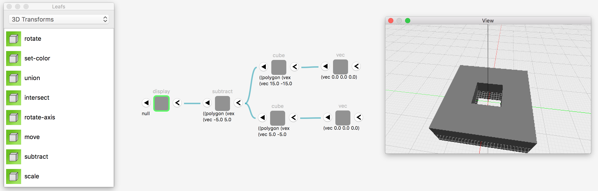
##define
defineを使うことでリーフの戻り値を変数にバインドすることができます。これによって、複数のリーフから参照することができます。

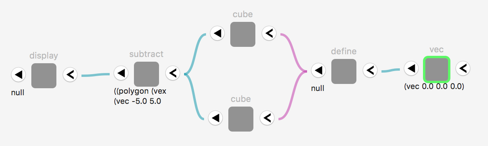

※set!もあるが使用は非推奨。visual programming languageのため、計算順序が保証されない。begin等で制御する必要があり。

※値だけでなく手続きもバインドできます。名前空間は変数と同一(Lisp1)
#todo/やることリスト
- [ ] プリプロセッサの追加
	- [ ] import
	- [ ] マクロ
- [ ] ライン描画機能
- [ ] リーフの複数選択、Undo/Redo
- [ ] 2D描画port
